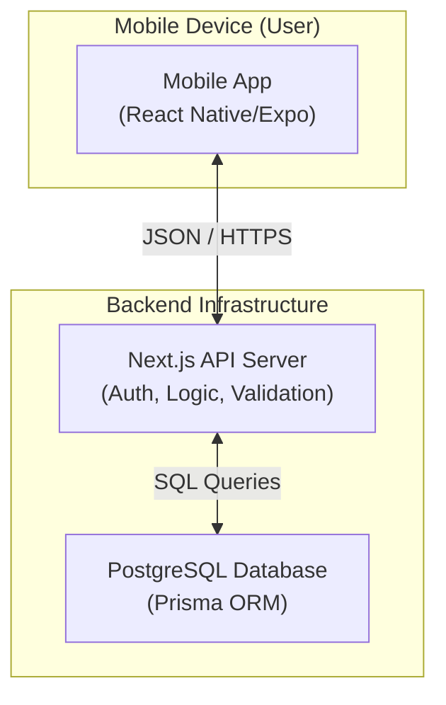
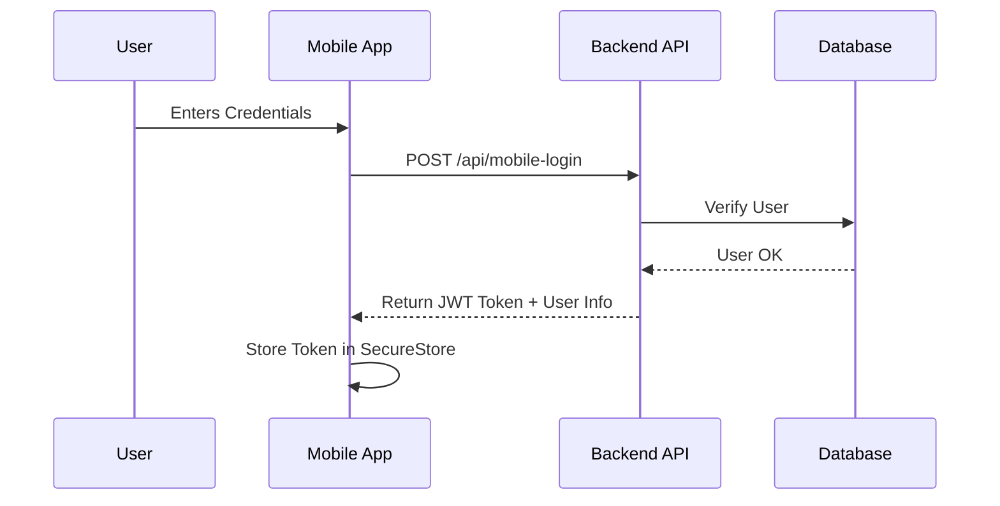
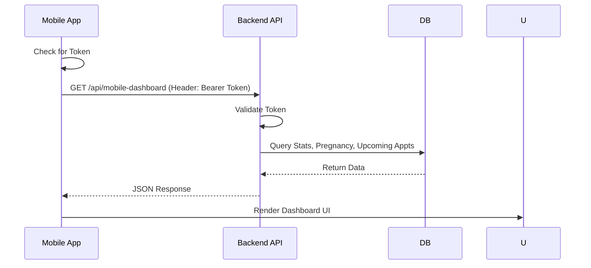

# 🤰 PrentalPlus Mobile App

**PrentalPlus Mobile** is a comprehensive prenatal care application designed to support expecting mothers throughout their pregnancy journey. It tracks vitals, appointments, medications, and baby growth, providing real-time health insights and educational content.

Built with **React Native (Expo)** and **TypeScript**, it specifically targets iOS and Android platforms with a premium, user-friendly interface.

---

## 🏗️ System Architecture

The PrenatalPlus ecosystem consists of a Mobile App (Frontend) and a unified Backend API.



### Component Interaction

1.  **Mobile App (Client):**
    *   **UI Layer:** Built with React Native components and `NativeWind` for styling.
    *   **Data Layer:** Uses `Axios` to communicate with the Backend API.
    *   **State:** Local state management with React Hooks (`useState`, `useContext` for Auth).
    *   **Storage:** `Expo SecureStore` is used to safely store the Authentication Token (JWT).

2.  **Backend API (Server):**
    *   **Endpoints:** RESTful API routes (`/api/mobile-*`) specifically designed for mobile consumption.
    *   **Auth:** Handles Login/Register and verifies `Bearer` tokens for protected routes.
    *   **Logic:** Validates input (Zod schemas), processes business logic (e.g., due date calculation), and formats responses.

3.  **Database:**
    *   **PostgreSQL:** Stores user profiles, vitals, appointments, and medical records.
    *   **Prisma:** Acts as the ORM to interact with the database safely and strictly typed.

---

## 🔄 Data Workflow

### 1. Authentication Flow


### 2. Data Fetching (e.g., Dashboard)


---

## 🛠️ Technology Stack

*   **Framework:** [Expo](https://expo.dev/) (React Native)
*   **Language:** TypeScript
*   **Styling:** NativeWind (TailwindCSS for React Native)
*   **Navigation:** Expo Router (File-based routing)
*   **Icons:** Lucide React Native
*   **Networking:** Axios
*   **Storage:** Expo SecureStore

---

## 🚀 Getting Started

### Prerequisites
*   Node.js (v18+)
*   npm or yarn
*   **Expo Go** app on your physical device (iOS/Android) OR Android Emulator / iOS Simulator.

### Installation

1.  **Clone the Repository:**
    ```bash
    git clone https://github.com/kishorathod/PrentalPlusMobileApp.git
    cd PrentalPlusMobileApp
    ```

2.  **Install Dependencies:**
    ```bash
    npm install
    # or
    yarn install
    ```

3.  **Environment Setup:**
    Ensure the `src/lib/api.ts` file points to your running backend URL.
    *   *Development:* Update `baseURL` to your local machine's IP (e.g., `http://192.168.1.5:3000`).

### Running the App

1.  **Start the Development Server:**
    ```bash
    npx expo start
    ```

2.  **Run on Device:**
    *   Scan the QR code with the **Expo Go** app (Android) or Camera (iOS).

---

## 📂 Project Structure

```
app/
├── (auth)/          # Authentication screens (Login, Register)
├── (tabs)/          # Main Tab Bar screens (Home, Vitals, Reports, Profile)
├── growth/          # Baby Growth features
├── medications/     # Medication Tracker features
├── profile/         # Profile sub-settings
├── _layout.tsx      # Root layout & Theme provider
└── index.tsx        # Entry redirect logic
src/
├── components/      # Reusable UI components
├── context/         # React Context (AuthContext)
└── lib/             # Utilities (API, Helper functions)
```
